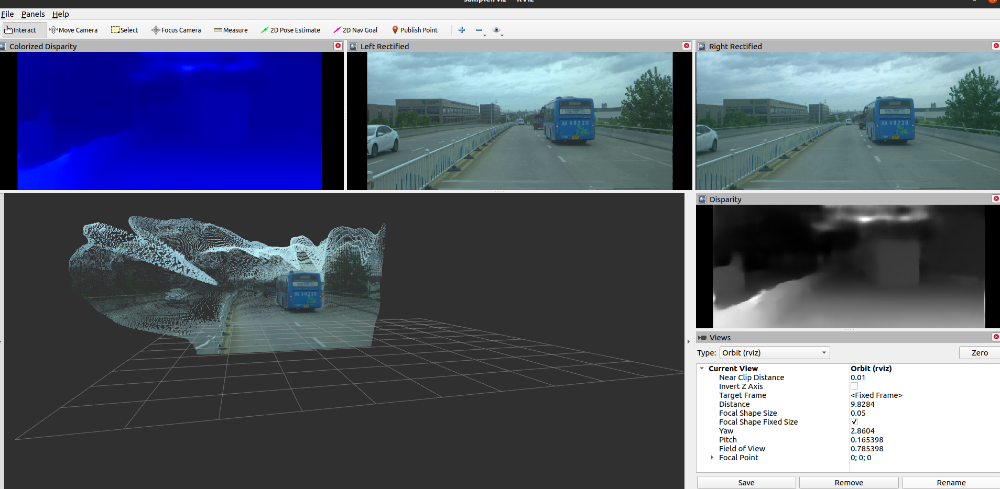

# 📝 aanet_stereo_matching_ros #
***

ROS package for stereo matching and point cloud projection using [AANet](https://arxiv.org/abs/2004.09548)

## :tada: TODO
***

- [x] create ros nodes to get disparity map from stereo matching with AANet
- [x] create pseudo-lidar point cloud from disparity map with camera info

## 🎛  Dependencies
***

- create stereo_matching conda environment
```bash
    conda env create --file environment.yml
```

- Fetch [AANet](https://github.com/haofeixu/aanet)
```bash
    git submodule update --init --recursive
```

- Activate conda environment and build deformable convolution for aanet
```bash
    conda activate stereo_matching
    cd ./scripts/aanet/nets/deform_conv && bash build.sh
```

- python3: this package (also the original implementation) uses python3, which is taboo for ROS1. One solution to avoid confliction between ROS1 and python3 is to run roslaunch under the directory with stereo_matching env activated.

## 🔨 How to Build ##
***
Better to build with catkin or colcon
Before building with ROS build tool, config current ROS workspace to use python in stereo_matching conda environment with

```bash
    catkin config -DPYTHON_EXECUTABLE=`which python` -DPYTHON_INCLUDE_DIR=`python -c "from __future__ import print_function; from distutils.sysconfig import get_python_inc; print(get_python_inc())"` -DPYTHON_LIBRARY=`python -c "from __future__ import print_function; import distutils.sysconfig as sysconfig; print(sysconfig.get_config_var('LIBDIR') + '/' + sysconfig.get_config_var('LDLIBRARY'))"`
    catkin build
```

## :running: How to Run ##
***

- A sample rosbag of stereo images created from [DrivingStereo Dataset](https://drivingstereo-dataset.github.io/) with [this tool](https://github.com/xmba15/image_dataset_to_rosbag) has been prepared [HERE](https://drive.google.com/file/d/1MtEHVBYFhwIODbZDrk7tJ5AdOeW9r3UE/view?usp=sharing). Please download and extract into ./data/output.bag

- Download AANet+ KITTI 2015 model from [MODEL ZOO](https://github.com/haofeixu/aanet/blob/master/MODEL_ZOO.md) and put into ./data/aanet+_kitti15-2075aea1.pth

- Start sample roslaunch
```bash
    roslaunch aanet_stereo_matching_ros aanet_stereo_matching_ros_rviz_sample.launch
```

Please take a look at the sample roslaunch to know how to use the parameters.
Tune img_scale with bigger value (1.0 means original image size) would yeild better point cloud at the cost of speed. Currently the perspective projection from disparity to point cloud in python seems costly. Might be better to just propagate disparity message and do the projection in C++ package.



## :gem: References ##
***

- [1] [AANet: Adaptive Aggregation Network for Efficient Stereo Matching, CVPR 2020](https://arxiv.org/abs/2004.09548)
- [2] [Original Implementation](https://github.com/haofeixu/aanet)
